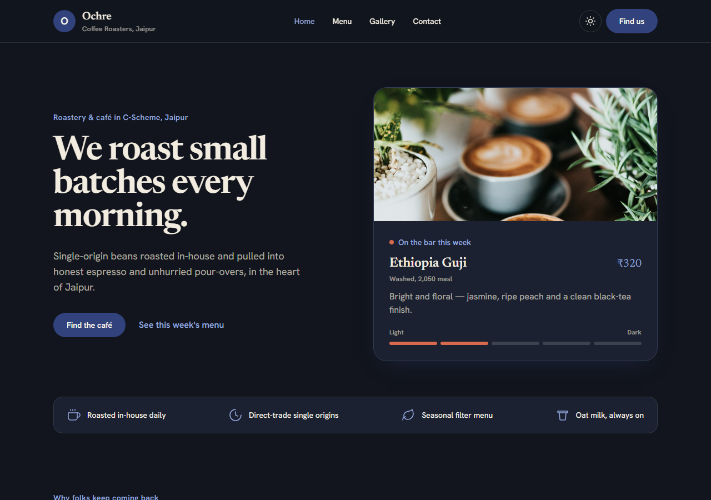
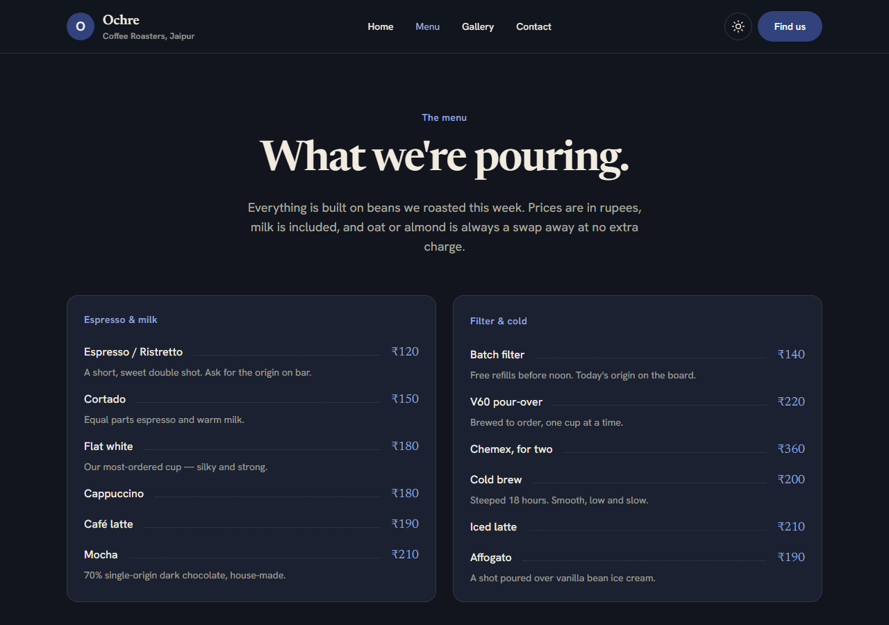
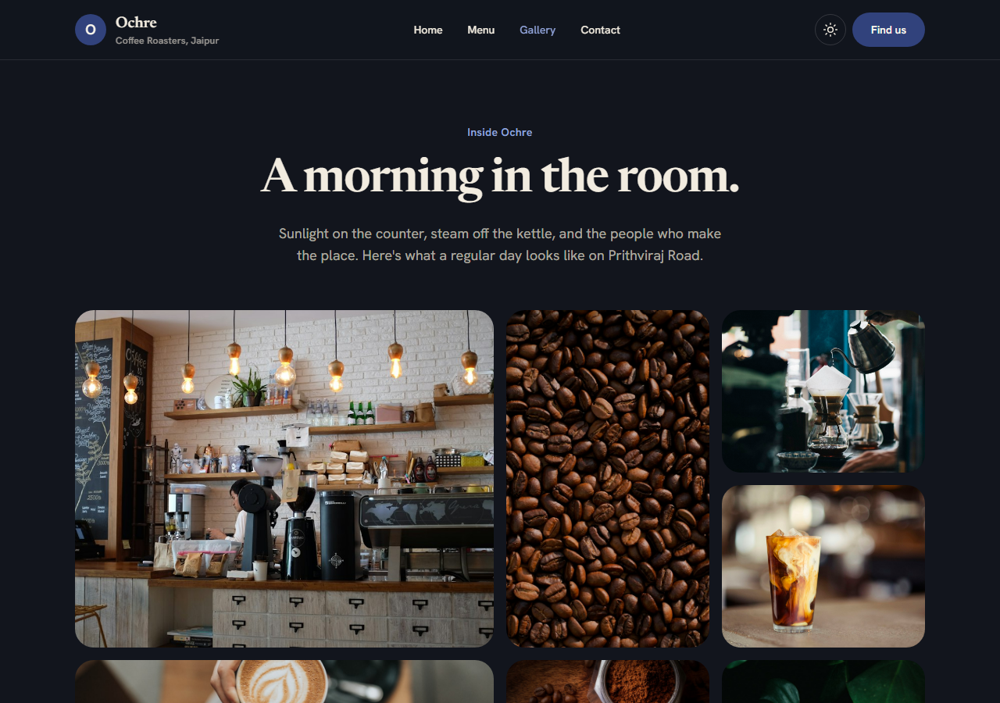
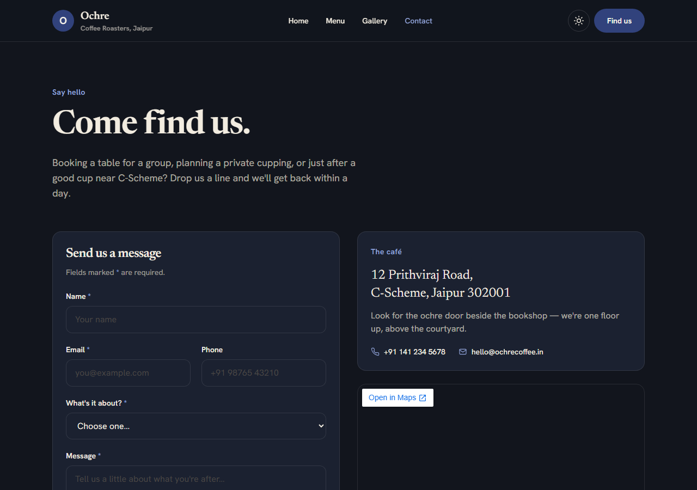

# Ochre Coffee Roasters

A small marketing website for a specialty coffee café and roastery in C-Scheme, Jaipur. Hand-coded as a four-page static site — no page builder, no template — styled entirely with Tailwind CSS in a warm, editorial palette.

**Live site:** _add your Vercel URL here after deploying_ → `https://<your-project>.vercel.app`

## Screenshots

| Home | Menu |
| --- | --- |
|  |  |

| Gallery | Contact |
| --- | --- |
|  |  |

> Screenshots go in `docs/screenshots/`. Grab one of each page once it's deployed — the dark theme photographs especially well.

## Pages

- **Home** (`index.html`) — hero, why-us highlights, three featured coffees with a roast-level meter, hours, and location.
- **Menu** (`menu.html`) — the drinks board (espresso, filter & cold), beans to take home, and a small kitchen menu.
- **Gallery** (`gallery.html`) — a photo mosaic of the café and roastery.
- **Contact** (`contact.html`) — an accessible enquiry form, address, opening hours, and an embedded map.

## Tech

- **HTML5** — semantic structure (`header`, `nav`, `main`, `section`, `article`, `footer`).
- **Tailwind CSS v3.4** — utility-first styling, compiled with the Tailwind CLI (not the CDN). Colours, fonts, and breakpoints live in `tailwind.config.js`.
- **Vanilla JavaScript** — one small `js/main.js` for the dark-mode toggle, mobile menu, footer year, and contact-form validation. No libraries.
- **Google Fonts** — Fraunces (display serif) and Hanken Grotesk (body).

## Features

- **Responsive, mobile-first** — checked at 375px, 768px, and 1280px with no horizontal scroll; images scale.
- **Both layout systems, used meaningfully** — CSS Grid for 2D layouts (photo mosaic, coffee cards, footer) and Flexbox for 1D rows (nav, price rows, meta lists).
- **Dark mode** — a toggle that remembers your choice in `localStorage`, falling back to your system's `prefers-color-scheme`.
- **Accessible** — a label tied to every form field, correct input types with `required` where it matters, meaningful `alt` text, a skip link, visible keyboard-focus rings, and `aria` attributes on interactive controls.
- **No inline styles** — everything comes from Tailwind utilities or the small component layer in `css/input.css`.

## Project structure

```
.
├── index.html          # Home
├── menu.html           # Menu
├── gallery.html        # Gallery
├── contact.html        # Contact
├── css/
│   ├── input.css       # Tailwind directives + small component layer (source)
│   └── style.css       # Compiled, minified output (loaded by the pages)
├── js/
│   └── main.js         # Theme toggle, mobile menu, form validation
├── assets/
│   ├── favicon.svg
│   └── images/         # Photography (café, coffee, gallery)
├── tailwind.config.js  # Theme: colours, fonts, breakpoints
├── package.json        # Build script
└── vercel.json         # Deploy config
```

## Run it locally

You'll need [Node.js](https://nodejs.org) installed.

```bash
npm install
npm run build      # compiles css/input.css → css/style.css
```

Then open `index.html` in your browser, or serve the folder:

```bash
npx serve .
```

While editing styles, rebuild after changes — or run the Tailwind CLI in watch mode:

```bash
npm run build -- --watch
```

## Deploying to Vercel

1. Push this repo to GitHub.
2. Import it at [vercel.com/new](https://vercel.com/new).
3. Vercel runs `npm run build` and serves the folder as-is (see `vercel.json`).
4. Copy the live URL back into the **Live site** link near the top.

---

Hand-coded as a milestone project. Coffee names, prices, and photography are for demonstration only.


